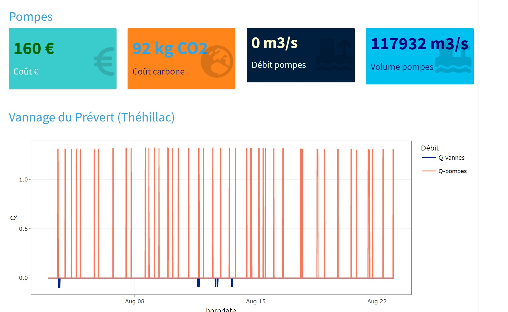

# Le vannage de l'Isac

## Le vannage

## Les niveaux

## Les débits

## Le fonctionnement des pompes

Sur le vannage deux pompes servent à limiter le niveau dans les marais.
Elles fonctionnent principalement pendant l'été.
Le débit est proche d'1 m3/s par pompe.
Le débit des pompes est rapporté sur la page Isac onglet Graphiques.
Dans les boites on trouve pour la période sélectionnée :

* le coût de fonctionnement (uniquement la dépense pas les abonnements), 
* l'empreinte carbone du fonctionnement des pompes.
* le débit moyen des pompes,
* le volume total évacué par les pompes. 

## Les indicateurs