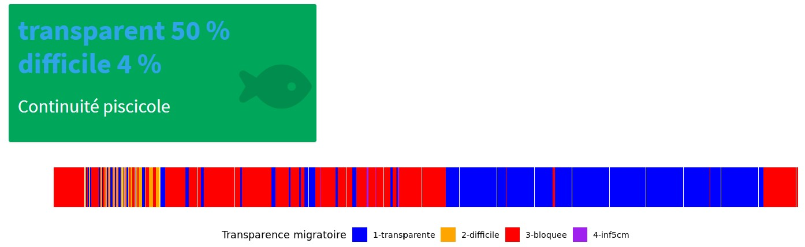

# Le vannage de l'Isac

Il est situé à la confluence entre l'ancien cours de l'Isac et la Vilaine, entre la commune de Fégréac (44057)et de Thehillac (56250).
C'est un ancien ouvrage anti-marée qui a été renové dans les années 2000 afin de mieux gérer les niveaux d'eau en hiver comme en été. Il permet une déconnexion totale des niveaux d'eau en Vilaine.
Il est la propriété d'Eaux et Vilaine qui en assure également sa gestion.

## Le fonctionnement du vannage

En hiver, les vannes sont fermées pour atteindre une cote de gestion "haute" en amont de l'ouvrage. Un automate permet de réguler le niveau d'eau par des ouvertures plus ou moins grandes des deux portes. L'eau qui s'échappe passe par le fond. Cette déconnexion partielle permet de stabiliser le niveaux d'eau contrairement à ce qui se passe en Vilaine en raison du barrage d'Arzal.
De la fin du printemps à l'été, les vannes sont également fermées. Les 2 pompes se relaient alors pour baisser le niveau d'eau en amont qui est alors inférieur à celui de la Vilaine. Ce pompage permet l'entretien des marais par une gestion agricole extensive.
Le reste du temps, le vannage est ouvert pour permettre une continuité piscicole et sédimentaire.

## Les niveaux

Depuis 2016, le vannage fonctionne en phase expériementale, avec une gestion des niveaux d'eau a minima en raison du développement de la Jussie (Espèce Exotique Envahissante) dans les marais de l'Isac.
En hiver, la cote consigne est de 2m40 NGF, permettant une submersion d'une grande partie du marais jusqu'en mars.
Le pompage est activé de début Mai à début Octobre avec une cote de gestion à 1m80 NGF afin de faciliter l'exploitation agricole du marais et limiter le développement de la Jussie.

## Les débits

Les débits sont calculées à l'aide de la formule de manning. Ils peuvent être négatifs si les vannes sont ouvertes et que le niveau Vilaine est supérieur à celui des marais de l'Isac.

## Le fonctionnement des pompes

Sur le vannage, les deux pompes se relaient pour mainteni un niveau d'eau bas dans les marais.
Elles fonctionnent principalement pendant l'été.
Le débit est proche d'1 m3/s par pompe.
Le débit des pompes est rapporté sur la page Isac onglet Graphiques.
Dans les boites on trouve pour la période sélectionnée :

* le coût de fonctionnement electrique (uniquement la dépense pas les abonnements), 
* l'empreinte carbone du fonctionnement des pompes.
* le débit moyen des pompes,
* le volume total évacué par les pompes. 

## Les indicateurs

Pour calculer les indicateurs, choisir quelle sonde doit être utilisée pour : les niveaux en amont du vannage du Prévert, les
niveaux en aval du vannage du Prévert, et les niveaux dans les marais.

### Transparence migratoire 

L'indicateur transparence migratoire évalue la franchissabilité du vannage. 
La transparence migratoire dépend de l'ouverture des vannes. On ne considère qu'il peut y avoir de migration que si une des
deux vannes est ouverte de plus de 5 cm. Le codeur de l'une des vannes peut être mal réglé et indiquer une ouverture de 1 ou 2 cm alors que la 
vanne est effectivement fermée.
Elle dépend également de la différence de niveau entre l'amont et l'aval, qui peut être positive ou négative. En valeur absolue,
une différence de niveau de moins de 30 cm est considérée comme favorable à la migration. Entre 30 et 50 cm la migration est considérée
comme difficile, au delà de 50 cm la migration est considérée comme bloquée.
La couleur de la boite correspond à la franchissabilité 
la plus représentée sur la période. 

### Avifaune

L'indicateur avifaune indique si la gestion des niveaux est favorable à l'accueil des oiseaux hivernant. Les seuils choisis sont 2m40 NGF
pour un niveau favorable, entre 2.20 et 2m40 l'accueil est considéré comme moyen, en dessous il est jugé défavorable.

### Reproduction et émergence du brochet

L'indicateur reproduction du brochet évalue deux périodes. La période de reproduction, du 25/02 au 15/03 et la période d'émergence
du 15/03 au 01/05. Pendant la période de reproduction, un niveau supérieur à 2.30 est favorable à la reproduction, entre 2.20 et 2.30 
les conditions sont moyennes. En dessous de 2.20 la reproduction est limitée aux fossés et elle est considérée comme défavorable.
Après la reproduction, lors de l'émergence on compare le niveau au niveau de la reproduction, lorsque le niveau descend 10 cm en dessous 
du niveau de reproduction, les conditions d'émergence sont considérées comme défavorable. Même si l'émergence est calculée comme favorable,
 elle dépend aussi bien sûr des conditions de reproduction.
 
